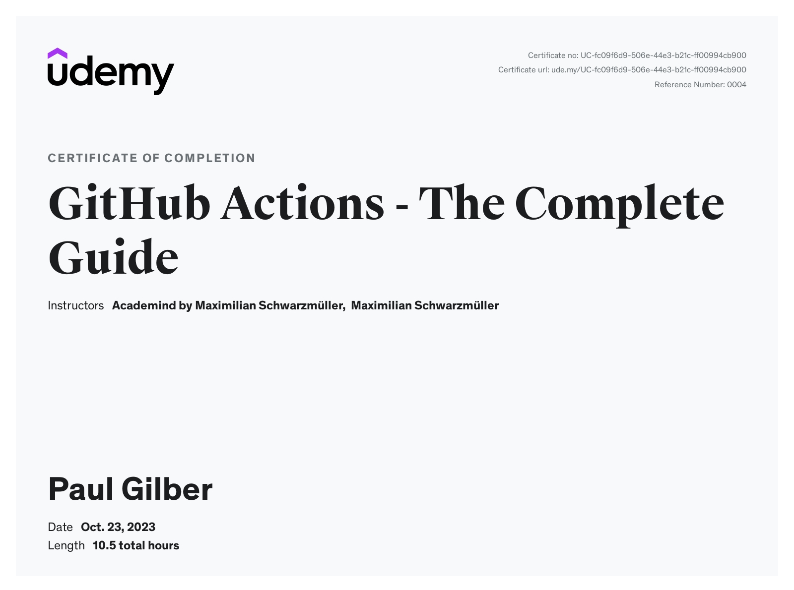

# My Trainings and Certifications

## Certifications
### Issued by AWS
- [AWS Certified SysOps Administrator – Associate](https://www.credly.com/badges/b7478c5b-ff51-4a8e-89e0-f2902561cdd1/public_url)
- [AWS Certified Developer – Associate](https://www.credly.com/badges/01ddc06c-b0c7-4e08-b7bd-eac826c51cf0/public_url)
- [AWS Certified Solutions Architect – Associate](https://www.credly.com/badges/eb46949e-4c77-4da6-a385-448b8e308804/public_url)
- [AWS Certified Cloud Practitioner](https://www.credly.com/badges/2e5500e0-5d95-43da-b89b-e1f926414d65/public_url)
### Issued by IBM
- [DevSecOps Essentials](https://www.credly.com/badges/17a21665-116a-42ca-9883-0752bb5c55ca/public_url)
- [Enterprise Design Thinking Practitioner](https://www.credly.com/badges/ea46ff0f-2234-4feb-8830-6317be2bb80b/public_url)
- [Architectural Thinking](https://www.credly.com/badges/060c3b5e-2c65-499d-93e2-273a5cc15648/public_url)
- [IBM Garage Essentials](https://www.credly.com/badges/dbf66516-3941-4c86-837b-bf1f1df58ae8/public_url)
- [Docker Essentials: A Developer Introduction](https://www.credly.com/badges/c092e941-b6f8-4282-bf81-dea5042a983f/public_url)
- [IBM Automation: Compass](https://www.credly.com/badges/307f0695-75f7-4ca4-b954-5f36376209e5/public_url)
### Issued by The Linux Foundation
- [CKA: Certified Kubernetes Administrator](https://www.credly.com/badges/986d2e02-084d-4f61-aa6a-126019472f64/public_url)
- [CKAD: Certified Kubernetes Application Developer](https://www.credly.com/badges/cccb81ca-cc93-4e49-a07a-90b06510713f/public_url)
### Issued by Microsoft
- [Microsoft Certified: Azure Solutions Architect Expert](https://www.credly.com/badges/44056695-e65d-45a2-bc5e-c53fc7657cbc/public_url)
- [Microsoft Certified: Azure Fundamentals](https://www.credly.com/badges/6ebcd2f5-03a2-468c-aaf2-055d4ec09370/public_url)
### Issued by Red Hat
- [Red Hat Certified OpenShift Administrator](https://www.credly.com/badges/db5ecd2f-887d-49d1-a712-e664bda7d01d/public_url)
- [Red Hat Certified Specialist in Containers and Kubernetes](https://www.credly.com/badges/74c29c7a-b81b-4971-aea0-25f0f144ba65/public_url)
### Issued by Project Management Institute
- [Disciplined Agile Senior Scrum Master (DASSM)](https://www.credly.com/badges/3d24e1d8-ba52-4f59-8310-c0576a4ead9b/public_url)

## Trainings
- [GitHub Actions - The Complete Guide](https://www.udemy.com/course/github-actions-the-complete-guide/)
